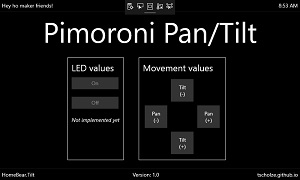

# HomeBear.Tilt

 

> Windows 10 IoT Core UWP app that works great with the Pimoroni [Pan-Tilt HAT](https://shop.pimoroni.com/products/pan-tilt-hat) (PIC16F1503).

## Prerequirements
- Windows 10
- Visual Studio 2019
- Raspbbery Pi 3 (B) with [Windows 10 IoT Core](https://developer.microsoft.com/en-us/windows/iot) 17763 or higher
- Pimoroni [Pan-Tilt HAT](https://shop.pimoroni.com/products/pan-tilt-hat)


## How it looks



## Features

- [x] Pans
- [x] Tilts
- [ ] Camera preview
- [ ] Controls LEDs

## Usage

Still heavily work in progress.

## Keep in mind

**This a is a learning project**

All features have room for improvements.

**Auto. granted permissions and capabilities**

The system will access your webcamera and microphone capabilities.

```
<Capabilities>
    <Capability Name="internetClient" />
    <DeviceCapability Name="webcam"/>
    <DeviceCapability Name="microphone"/>
  </Capabilities>
  ```

## Information

Most of the logic behind is based on the offical Python libraries.

## Known issues

- Reading of pan and tilt angles are (slighlty) off the actual value.
- The servos sometimes start to buzz quite heavily. 

## Ideas for the future

- Connect to Azure IoT Hub
- Add camera support
- Add XBox One controller support


## Contributing

Feel free to improve the quality of the code. It would be great to learn more from experienced C#, UWP and IoT developers.

## Authors

Just me, [Tobi]([https://tscholze.github.io).


## Thanks to

* Pimoroni [Discord](https://discordapp.com/invite/hr93ByC) Community
* Stackoverflow User [michael-xu-msft](https://stackoverflow.com/users/8546089/)
* Pimoroni Python [source](https://github.com/pimoroni/pantilt-hat/blob/master/library/pantilthat/pantilt.py)

## License

This project is licensed under the MIT License - see the [LICENSE](LICENSE.md) file for details.
Dependencies or assets maybe licensed differently.